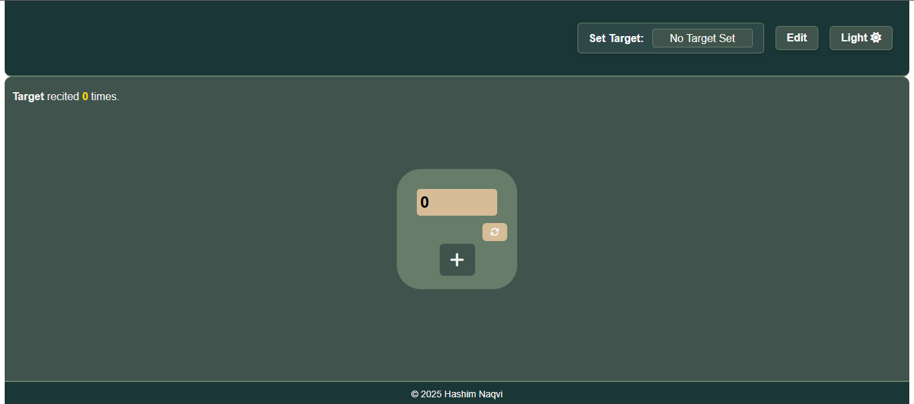
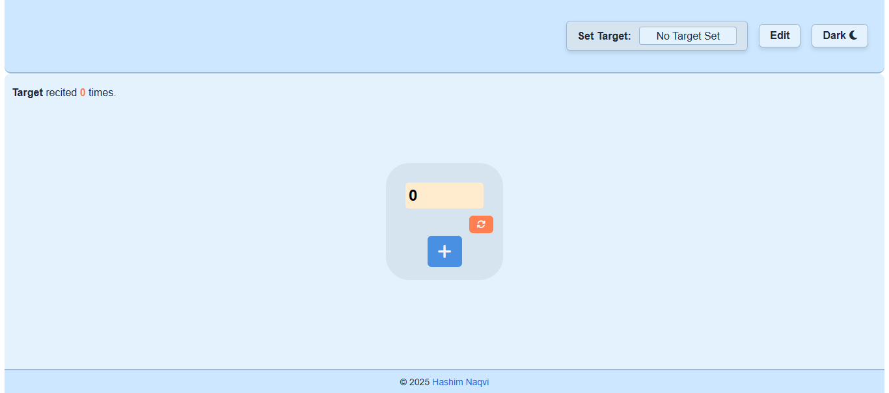

# Tasbeeh Counter

Welcome! This is a simple Tasbeeh counter that helps users keep track of their recitations. The app includes features such as a count reset, custom target input, light/dark mode toggle, target recited count, and a responsive design.
## Preview
Test the live version [here](https://047hashim.github.io/tasbeeh-counter/)
### Dark Mode

### Light Mode

## Features  

- **Count Reset** – Resets the counter to 0.  
- **Custom Target** – Allows setting a custom recitation target.  
- **Light/Dark Mode Toggle** – Switch between light and dark modes.  
- **Target Recited Count** – Shows how many times the target has been reached (e.g., 0 times, 1 time).  
- **Responsive Design** – Works smoothly on both desktop and mobile devices. 
